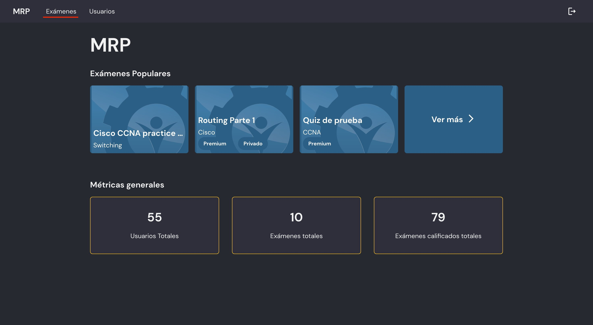
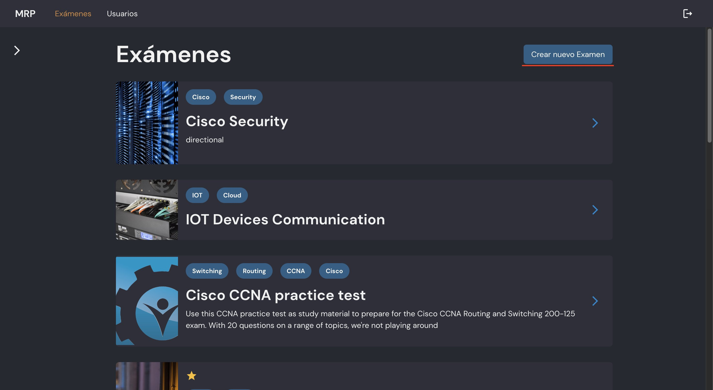
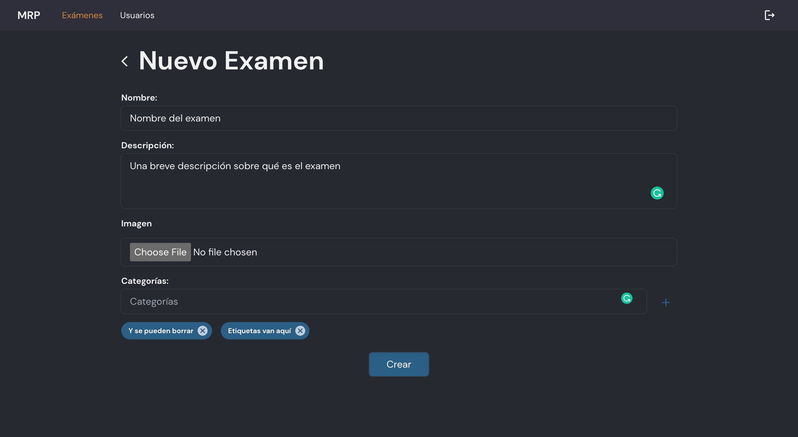
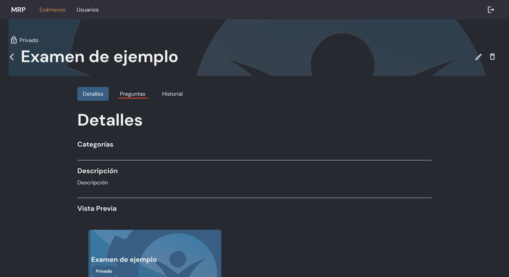
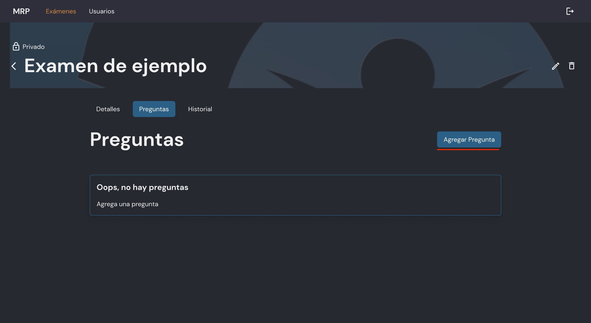
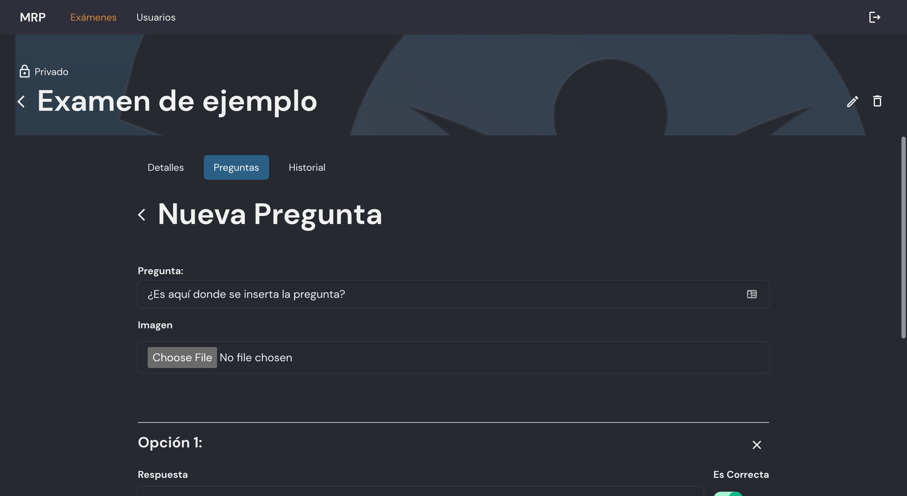
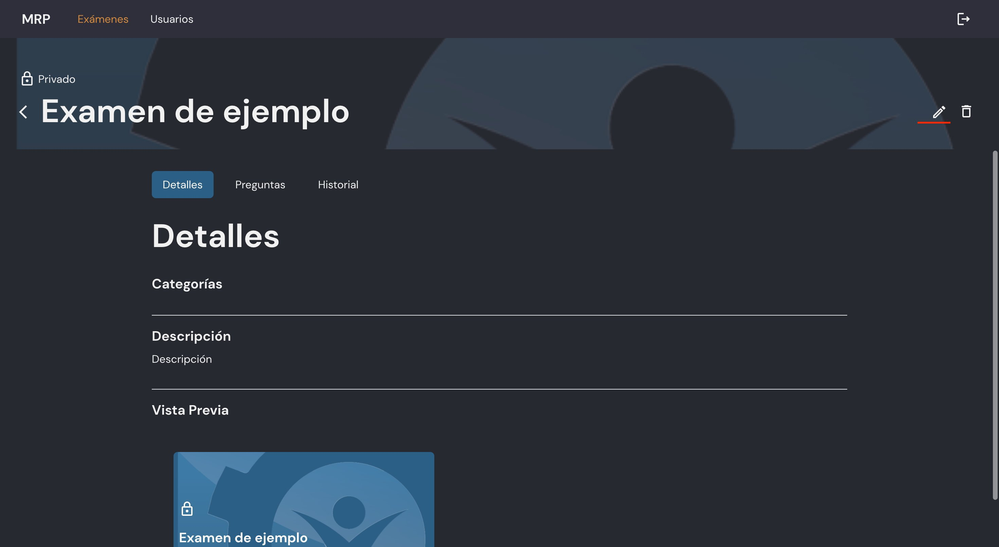
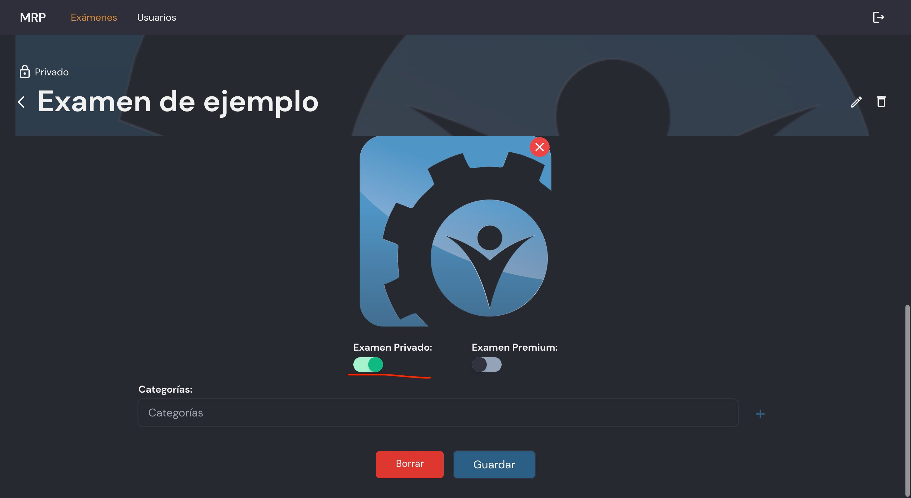

# Creación de un Examen

`4 Taquitos y Asociados` 16 Noviembre 2022

## Navegar a la página de Exámenes

## Hacer click en botón de "Crear Nuevo Examen"

## Llenar información general del examen

## Hacer click en la sección de preguntas

## Hacer click en el botón de Agregar Pregunta

## Complete el formulario

## Cree las preguntas que necesite de la misma forma

## Una vez que termine, haga click en el botón de editar

## Cambie la visibilidad del examen para que se refleje en la aplicación

