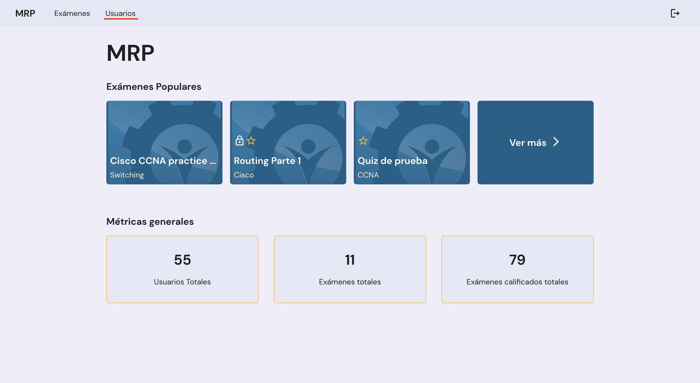
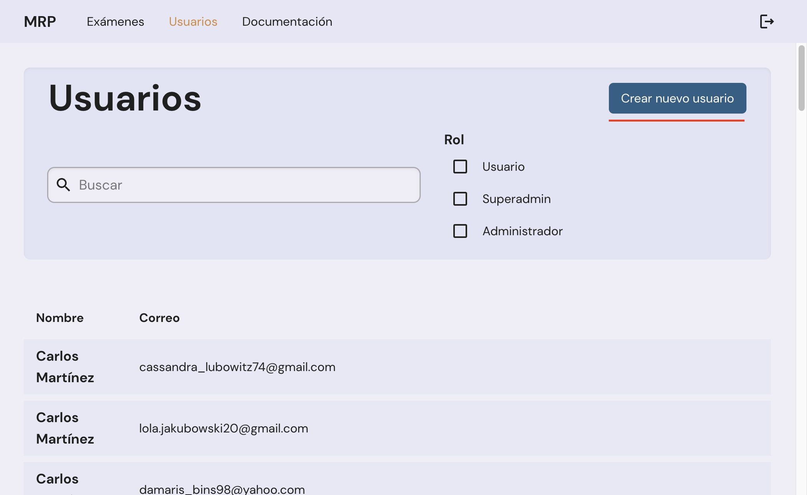
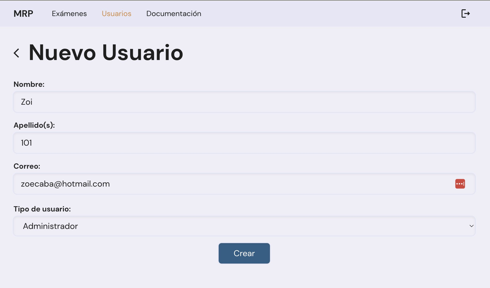

# Creación de un Usuario

`4 Taquitos y Asociados` 22 Noviembre 2022

## Navegar a la página de Usuarios

## Hacer click en botón de "Crear Nuevo Usuario"

## Llenar información del usuario

## Hacer click en el botón de Crear

## Informar a la persona

A su correo le llegó un email con un código. Con ese código puede entrar a la aplicación a crear la contraseña para su nueva cuenta.

Si es una cuenta de administrador, deberá reiniciar su contraseña en la aplicación móvil antes de poder acceder a este panel administrativo.
