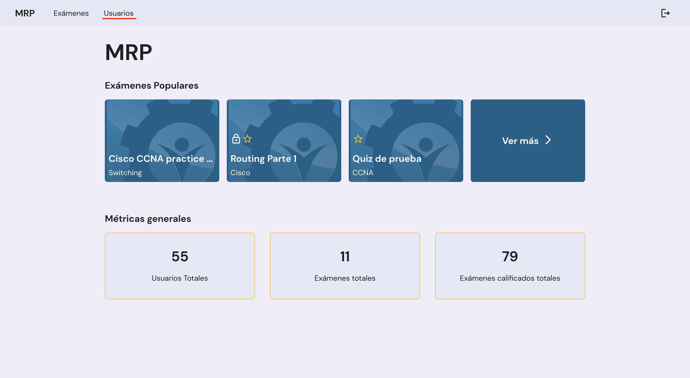
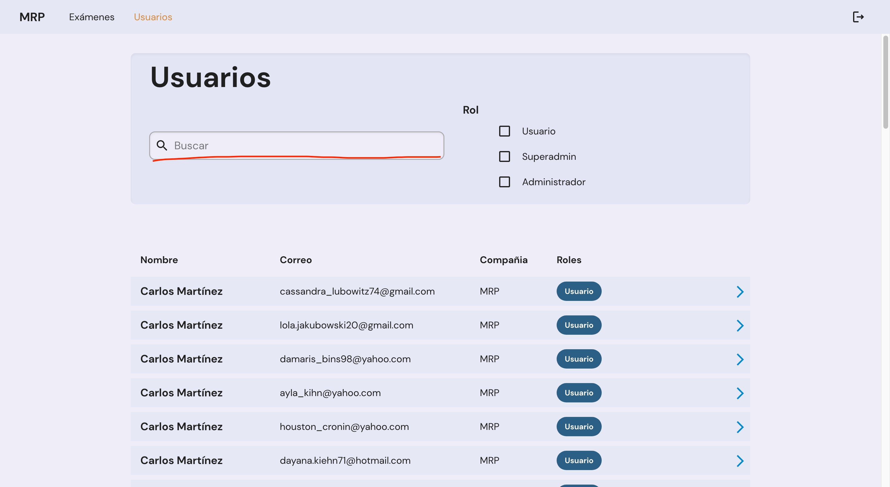
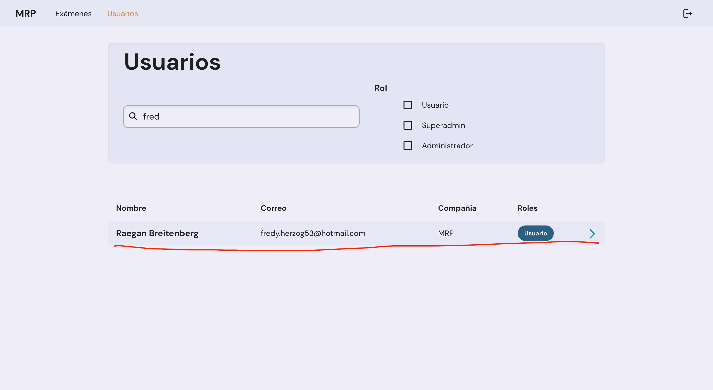
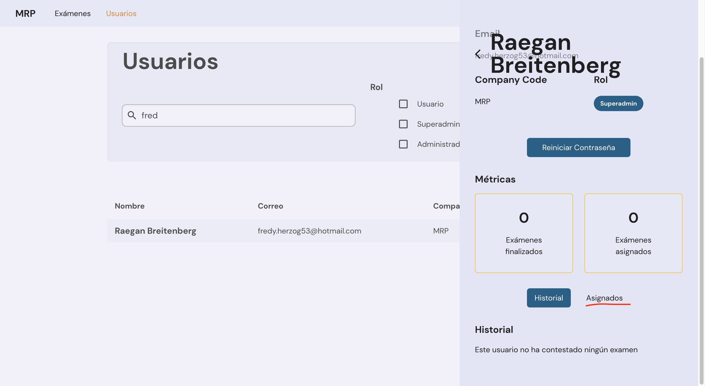
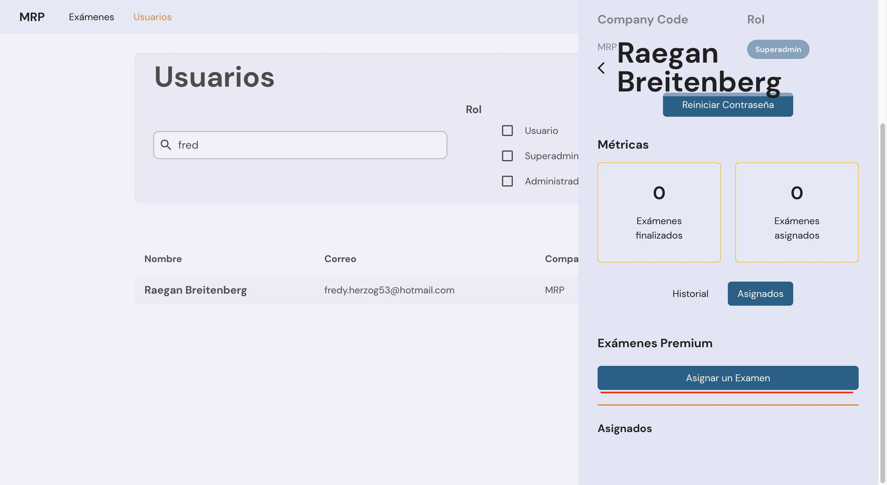
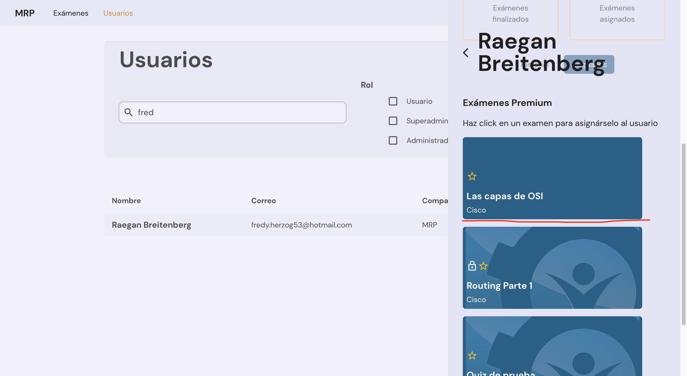

# Asignar un Examen

`4 Taquitos y Asociados` 22 Noviembre 2022

## Navegar a la página de Usuarios

## Buscar al usuario que le queremos asignar el examen

## Navegar a la pestaña de "Asignados"

## Hacer click en el botón de "Asignar un Examen"

## Hacer click en el examen que queremos asignar

